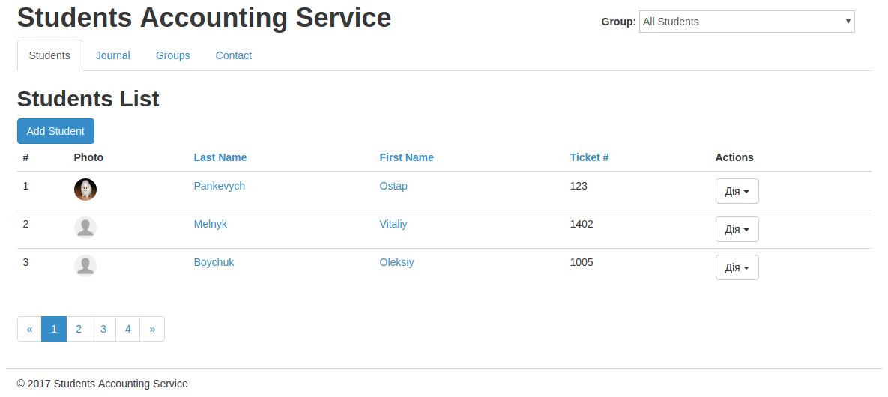
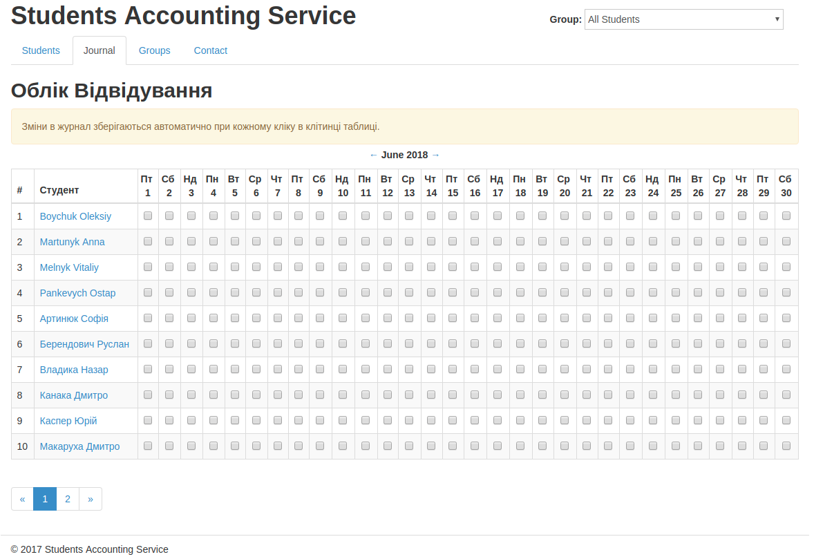
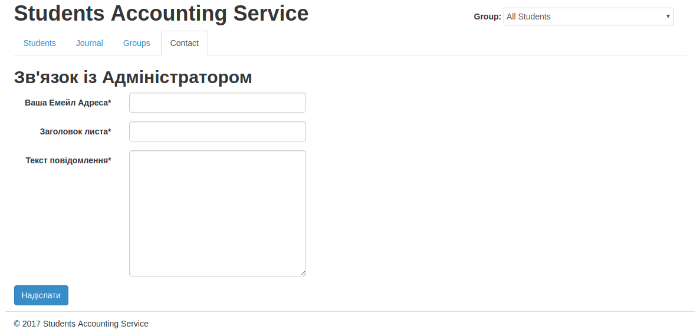
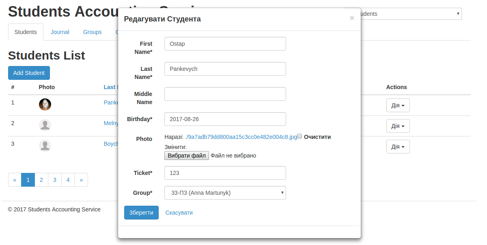

# django-studentsdb

Student accounting service by Django

Realized by **Python 3.5** and **Django 1.8**

## Deploy:

1. `pip install -r requirements.txt`

1. OPTIONAL `python manage.py loaddata demo_data.json`

1. `python manage.py migrate`

1. `python manage.py runserver`

## My profiles:
 - [VK](https://vk.com/victoria_1807)
 - [Telegram](https://telegram.me/Victoria1807)
 - [GitHub](https://github.com/Victoria1807)
 - E-mail - flamaster1807@gmail.com

